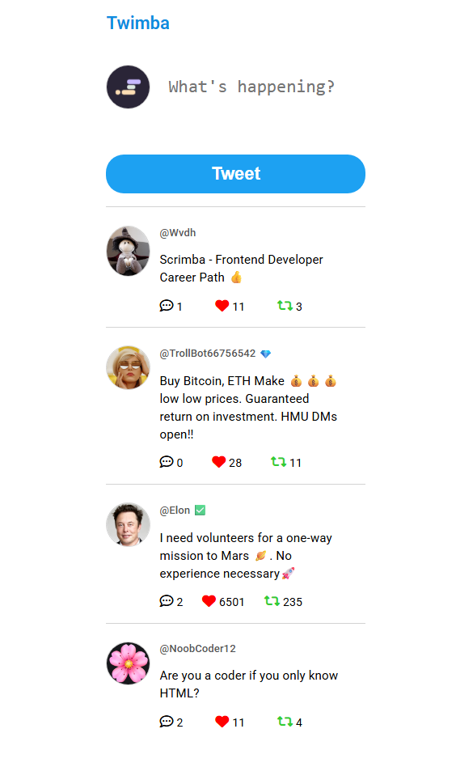

# Twimba 🚀 (Twitter clone)

**Twimba** is a frontend-only Twitter clone and it’s a lightweight, standalone app written in vanilla JavaScript—no backend required.

---

## 🌐 Live Demo

**Frontend**: [https://wvdh.github.io/Twimba](https://wvdh.github.io/Twimba)



---

## ✨ Features

- Post new tweets (with username/avatar placeholder)
- Like/unlike tweets
- Reply to tweets
- Delete tweets
- Tweet data is persisted in **LocalStorage**

---

## 📦 Tech Stack
```
| Layer      | Technology                     |
|------------|--------------------------------|
| Markup     | HTML5                          |
| Styling    | CSS3 (with CSS Variables)      |
| Logic      | Vanilla JavaScript (ES6+)      |
| Storage    | Browser LocalStorage           |
```

---
## 🧩 File Structure
```
📁 twimba/
├── images/
│   └── twimba.png   # Logo used in README
├── index.html       # Main app page
├── styles.css       # Dark theme + CSS variables
├── app.js           # Main JavaScript application logic
├── data.js          # Mock tweet data & utility functions
└── README.md
```

---
## 📝 License
This project is released under the MIT License — feel free to use, modify, and distribute it! See the LICENSE file for details.

---

## 🙋‍♂️ Author

Created by **WvdH**    
GitHub: [https://github.com/wvdh](https://github.com/wvdh)


